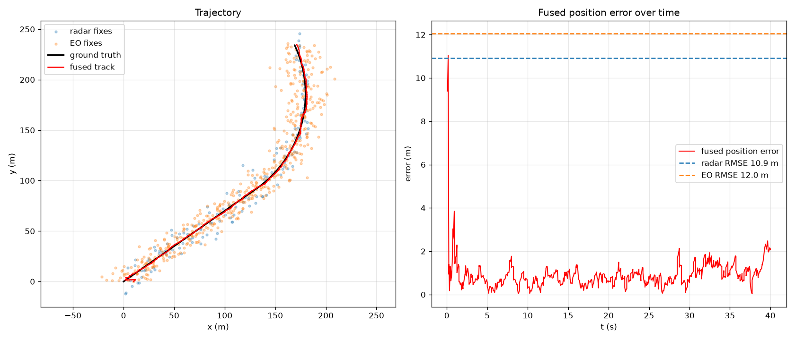

# Sensor-Fusion Tracker

A multi-rate, multi-sensor **Kalman filter** that fuses noisy **radar** and
**electro-optical (EO/IR)** position fixes into a single smoothed target track.

The two sensors are deliberately *complementary*: the radar is precise in the
range axis but coarse cross-range; the EO sensor is the reverse, and reports at
a higher rate. Neither alone gives a good track — fusing them does. This is the
core estimation problem behind ground-vehicle situational awareness, air
surveillance, and fire-control tracking.

> Built as a weekend portfolio piece. Synthetic data only, defensive/situational-
> awareness framing — no targeting or guidance logic.

```
            ┌────────────┐  measurements.csv  ┌─────────────────┐  track.csv  ┌──────────────┐
 Python ──▶ │  simulate  │ ─────────────────▶ │  C++ fusion core │ ──────────▶ │  visualize   │ ──▶ fusion.png
            │ (truth +   │   (t,sensor,x,y)   │  Kalman filter + │ (t,px,py,   │ (RMSE + plot)│     + RMSE
            │  sensors)  │                    │  CV tracker      │  vx,vy,σ)   │              │
            └────────────┘                    └─────────────────┘             └──────────────┘
```

CSV is the language boundary: Python owns simulation and scoring, C++ owns the
real-time estimation. See [ADR-0002](docs/adr/0002-cpp-core-python-shell.md).

## Result

Fusing the two sensors reduces position RMSE by ~90% versus either sensor
alone. Example run (`scripts/run_demo.sh`, seed 42):

| Source     | Position RMSE |
|------------|---------------|
| Raw radar  | 10.9 m        |
| Raw EO     | 12.0 m        |
| **Fused**  | **1.14 m**    |



Left: the fused track (red) hugs ground truth (black) through both the straight
leg and the turn, while the raw radar/EO fixes scatter widely. Right: fused
position error converges to ~1 m, far under either sensor's RMSE.

## Quick start

```bash
# one command: deps -> simulate -> build -> fuse -> score + plot
./scripts/run_demo.sh
```

Or step by step:

```bash
# 1. simulate ground truth + noisy sensor fixes
python3 -m venv .venv && source .venv/bin/activate   # recommended (PEP 668)
pip install -r python/requirements.txt
python python/simulate.py --out-dir data

# 2. build the C++ tracker (Eigen + GoogleTest fetched automatically)
cmake -S . -B build -DCMAKE_BUILD_TYPE=Release
cmake --build build -j

# 3. run the fusion core
./build/sft_app data/measurements.csv data/track.csv

# 4. score + plot
python3 python/visualize.py --data-dir data --track data/track.csv
```

## Tests

```bash
cmake --build build -j
ctest --test-dir build --output-on-failure
```

The GoogleTest suite covers the constant-velocity prediction, that an update
reduces uncertainty and pulls toward the measurement, covariance symmetry
(Joseph form), and an end-to-end check that fusion beats the raw measurements.

## Design

| Decision | Why | ADR |
|---|---|---|
| Linear KF + constant-velocity model | Sufficient for position-only fixes; clean and fully testable in a weekend | [0001](docs/adr/0001-linear-kf-constant-velocity.md) |
| C++ estimation core, Python sim/viz | Each language where it is strongest; CSV as a stable seam | [0002](docs/adr/0002-cpp-core-python-shell.md) |
| Joseph-form covariance update | Stays symmetric + positive-definite under round-off for long runs | [0003](docs/adr/0003-joseph-form-and-deps.md) |

## Layout

```
cpp/include/sft/   kalman_filter.hpp (templated, header-only), tracker.hpp, types.hpp
cpp/src/           tracker.cpp (CV model), main.cpp (CSV I/O)
cpp/tests/         test_kalman.cpp (GoogleTest)
python/            simulate.py, visualize.py
scripts/           run_demo.sh
docs/adr/          architecture decision records
```

## Possible extensions

- **EKF with polar radar** — model the radar in (range, azimuth) instead of
  Cartesian; the measurement model becomes nonlinear and needs a Jacobian.
- **IMM** (Interacting Multiple Model) for hard manoeuvres instead of a single
  constant-velocity model.
- **Track gating + association** (Mahalanobis distance) for multiple targets.
- Replace CSV with a streaming socket for a true real-time node.
